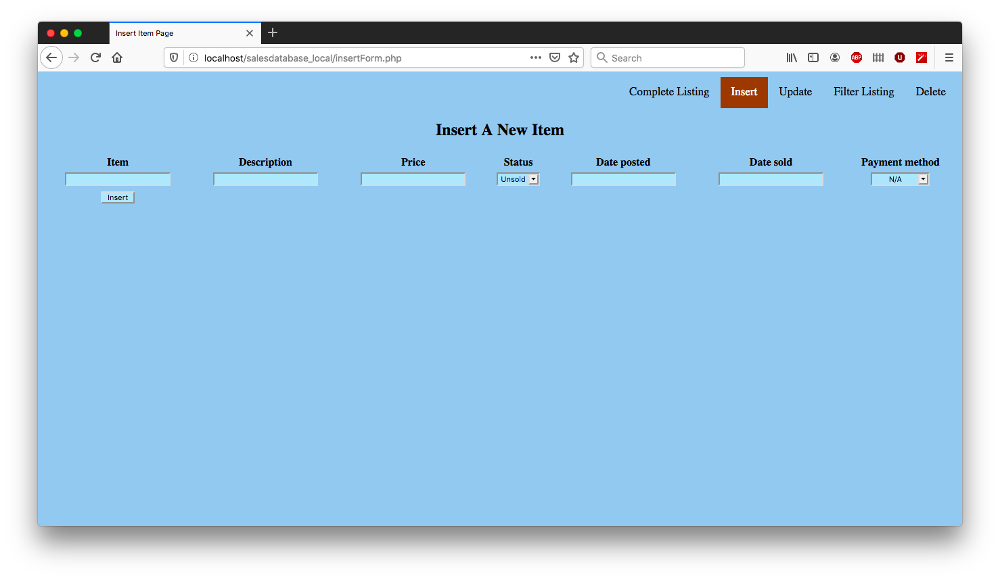

<!--
***Thank you for checking out my project. I am open to any suggestions for improvement.
***Please fork the repository and create a pull request or open an issue with the
***tag "improvement".
-->

# Sales Database Website

<br />
<p align="center">
  <a href="https://github.com/reoyamanaka/sales_database_website.git">
    
  </a>

  <h3 align="center">Sales Database Website</h3>

  <p align="center">
    A sales database website created using PHP, HTML, CSS and MySQL.
    <br />
    <a href="https://github.com/reoyamanaka/sales_database_website.git"><strong>Explore the docs »</strong></a>
    <br />
    <br />
    <a href="https://www.youtube.com/watch?v=TNc0G3Gmi5E">View Demo</a>
    .
    <a href="https://github.com/reoyamanaka/sales_database_website/issues">Report Bug</a>
  </p>
</p>

<!-- Table of Contents -->

* [About the Project](#about-the-project)
  * [Built with](#built-with)
* [Getting Started](#getting-started)
  * [Prerequisites](#prerequisites)
  * [Installation](#installation)
* [Usage](#usage)
* [Contributing](#contributing)
* [License](#license)

## About The Project
<p align="center">
  <strong>Full Listing Main Page<strong>
  
</p>

<p align="center">
  <strong>Insert Item Page<strong>
  
</p>

<p align="center">
  <strong>Update Item Page<strong>
  
</p>

<p align="center">
  <strong>Filter Items Page<strong>
  
</p>

<p align="center">
  <strong>Delete Item Page<strong>
  
</p>

### Built With

* PHP 7.3.11
* macOS High Sierra Version 10.13.6
* AMPPS 3.9
* Adobe Illustrator Version 23.1 (Logo design)

## Getting Started

To get a local copy up and running follow these simple steps.

### Prerequisites

* Download AMPPS <a href="https://ampps.com/download">here</a>. This will install other necessary tools such as PHP and MySQL.  

### Installation

1. Clone the repository
```sh
git clone https://github.com/reoyamanaka/sales_database_website.git
```
2. Launch AMPPS, start Apache and MySQL
<p align="center">
  
</p>

3. Access phpMyAdmin (localhost/phpmyadmin) and create a new database called `sales_database`. Create a user with all privileges and type in the appropriate database name (`sales_database`), username and password into the .php files.

4. After creating the database on phpMyAdmin, select it in the left section and click the "Import" tab near the top of the page. Import "sales_items.sql" to set up the table (or you can create the table yourself but importing would be easier and faster).

<p align="center">
  
</p>

## Usage

<div align="center">
  <strong>YouTube Demo</strong><br>
  <a href="https://www.youtube.com/watch?v=TNc0G3Gmi5E">
    
  </a>
</div>

## Contributing

I would greatly appreciate any contributions.

1. Fork the Project
2. Create your Feature Branch (`git checkout -b feature/CoolFeature`)
3. Commit your Changes (`git commit -m 'Added some CoolFeature'`)
4. Push to the Branch (`git push origin feature/CoolFeature`)
5. Open a Pull Request


## License

Distributed under the GNU Affero General Public License v3.0 License. See `LICENSE` for more information.

## Contact

Reo Yamanaka - [LinkedIn](https://www.linkedin.com/in/reo-yamanaka-7a2289119/) - [My YouTube channel](https://www.youtube.com/channel/UCBwqp_MEM2XcSnq7kRvOB3A) - ryamanaka807@gmail.com

Project Link: [https://github.com/reoyamanaka/sales_database_website](https://github.com/reoyamanaka/sales_database_website)
